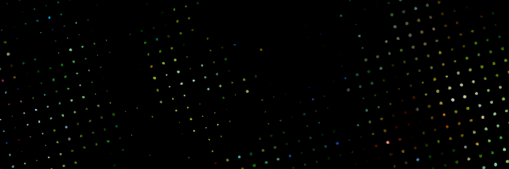

##  Hi, I'm Nick Dexter! 

###  A Little About Me...

Bachelor of ICT student at the [University of Tasmania](https://www.utas.edu.au/).

My main hobbies are Gaming and Photography.

### 🛠️Tech Stack
**Languages**  
&nbsp;
&nbsp;
&nbsp;
&nbsp;
&nbsp;

**Frontend** 
&nbsp;
&nbsp;

**Backend** 
&nbsp;
&nbsp;

**Tools** &nbsp;
&nbsp;
